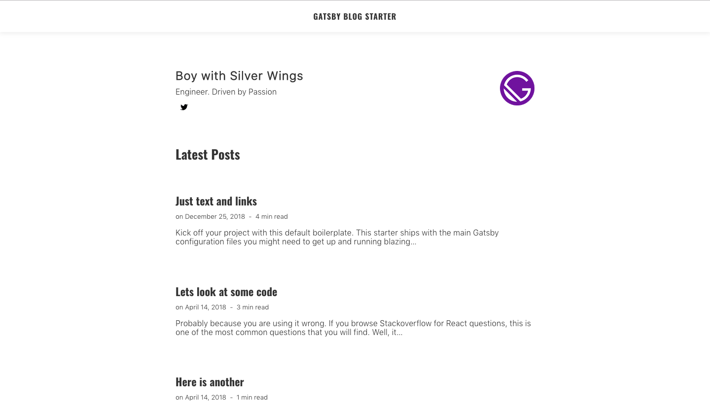

<!-- AUTO-GENERATED-CONTENT:START (STARTER) -->
<p align="center">
  <a href="https://www.gatsbyjs.org">
    
  </a>
</p>
<h1 align="center">
  Minimalist Blog Starter
</h1>

This project with `styled-components` shows off a minimalist blog layout.



**[See Live Demo](https://vigilant-leakey-a4f8cd.netlify.com/)**

## 🚀 Quick start

1.  **Create a Gatsby site.**

    Use the Gatsby CLI to create a new site, specifying the default starter.

    ```sh
    # create a new Gatsby site using the default starter
    npx gatsby new gatsby-blog https://github.com/BoyWithSilverWings/gatsby-blog-starter
    ```

1.  **Start developing.**

    Navigate into your new site’s directory and start it up.

    ```sh
    cd gatsby-blog/
    gatsby develop
    ```

1.  **Open the source code and start editing!**

    Your site is now running at `http://localhost:8000`!

    \_Note: You'll also see a second link: `http://localhost:8000/___graphql`. This is a tool you can use to experiment with querying your data. Learn more about using this tool in the [Gatsby tutorial](https://www.gatsbyjs.org/tutorial/part-five/#introducing-graphiql).\_

    Open the `gatsby-blog` directory in your code editor of choice and edit `src/pages/index.js`. Save your changes and the browser will update in real time!

## 💫 Deploy

[](https://app.netlify.com/start/deploy?repository=https://github.com/BoyWithSilverWings/gatsby-blog-starter)

## Blogs using this theme:

- [Mindless](https://blog.agney.in)
- _Add yours here_

## 🧐 What's inside?

A quick look at the top-level files and directories you'll see in a Gatsby project.

    .
    ├── node_modules
    ├── src
        ├── content
    ├── .gitignore
    ├── .prettierrc
    ├── gatsby-browser.js
    ├── gatsby-config.js
    ├── gatsby-node.js
    ├── gatsby-ssr.js
    ├── LICENSE
    ├── package-lock.json
    ├── package.json
    └── README.md

1.  **`/node_modules`**: This directory contains all of the modules of code that your project depends on (npm packages) are automatically installed.

2.  **`/src`**: This directory will contain all of the code related to what you will see on the front-end of your site (what you see in the browser) such as your site header or a page template. `src` is a convention for “source code”.

3.  **`src/content`**: Holds the markdown files for the blog

4.  **`.gitignore`**: This file tells git which files it should not track / not maintain a version history for.

5.  **`.prettierrc`**: This is a configuration file for [Prettier](https://prettier.io/). Prettier is a tool to help keep the formatting of your code consistent.

6.  **`gatsby-browser.js`**: This file is where Gatsby expects to find any usage of the [Gatsby browser APIs](https://www.gatsbyjs.org/docs/browser-apis/) (if any). These allow customization/extension of default Gatsby settings affecting the browser.

7.  **`gatsby-config.js`**: This is the main configuration file for a Gatsby site. This is where you can specify information about your site (metadata) like the site title and description, which Gatsby plugins you’d like to include, etc. (Check out the [config docs](https://www.gatsbyjs.org/docs/gatsby-config/) for more detail).

8.  **`gatsby-node.js`**: This file is where Gatsby expects to find any usage of the [Gatsby Node APIs](https://www.gatsbyjs.org/docs/node-apis/) (if any). These allow customization/extension of default Gatsby settings affecting pieces of the site build process.

9.  **`gatsby-ssr.js`**: This file is where Gatsby expects to find any usage of the [Gatsby server-side rendering APIs](https://www.gatsbyjs.org/docs/ssr-apis/) (if any). These allow customization of default Gatsby settings affecting server-side rendering.

10. **`LICENSE`**: Gatsby is licensed under the MIT license.

11. **`package-lock.json`** (See `package.json` below, first). This is an automatically generated file based on the exact versions of your npm dependencies that were installed for your project. **(You won’t change this file directly).**

12. **`package.json`**: A manifest file for Node.js projects, which includes things like metadata (the project’s name, author, etc). This manifest is how npm knows which packages to install for your project.

13. **`README.md`**: A text file containing useful reference information about your project.

## 🎓 Learning Gatsby

Looking for more guidance? Full documentation for Gatsby lives [on the website](https://www.gatsbyjs.org/). Here are some places to start:

- **For most developers, we recommend starting with our [in-depth tutorial for creating a site with Gatsby](https://www.gatsbyjs.org/tutorial/).** It starts with zero assumptions about your level of ability and walks through every step of the process.

- **To dive straight into code samples, head [to our documentation](https://www.gatsbyjs.org/docs/).** In particular, check out the _Guides_, _API Reference_, and _Advanced Tutorials_ sections in the sidebar.

_Have another more specific idea? You may want to check out our vibrant collection of [official and community-created starters](https://www.gatsbyjs.org/docs/gatsby-starters/)._

DO WORK

JavaScript
You need to know JavaScript and you need to know it inside out. The more senior level you are interviewing for the higher the expectations are in terms of depth of knowledge in the language. At a minimum, the following are topics within JavaScript you should know well:

- [x] Execution context, especially lexical scope and closures.
- [x] Hoisting, function & block scoping and function expressions & declarations.
- [x] Binding – specifically call, bind, apply and lexical this.
- [ ] Object prototypes, constructors and mixins.
- [ ] Composition and high order functions.
- [ ] Event delegation and bubbling.
- [ ] Type Coercion using typeof, instanceof and Object.prototype.toString.
- [ ] Handling asynchronous calls with callbacks, promises, await and async.
- [ ] When to use function declarations and expressions.
- [ ] DOM
- [ ] How to traverse and manipulate the DOM is important, and this is where most candidates struggle if they have been depending on jQuery or have been writing a lot of React & Angular type apps recently. You might not do this on a daily basis since most of us are using an abstraction of sorts, but without using a library you should know how to do the following:

- [ ] Selecting or finding nodes using document.querySelector and in older browsers document.getElementsByTagName.
- [ ] Traversal up and down – Node.parentNode, Node.firstChild, Node.lastChild and Node.childNodes.
- [ ] Traversal left and right – Node.previousSibling and Node.nextSibling.
- [ ] Manipulation – add, remove, copy, and create nodes in the DOM tree. You should know operations such as how to change the text content of a node and toggle, remove or add a CSS classname.
- [ ] Performance – touching the DOM can be expensive when you have many nodes, you should at least know about document fragments and node caching.
- [ ] CSS
- [ ] At a minimum, you would be expected to know how to layout elements on a page, how to target elements using child or direct descendant selectors and when to use classes vs IDs.

- [ ] Layout – sitting elements next to each other and how to place elements in two columns vs three columns.
- [ ] Responsive design – changing an element’s dimensions based on the browser width size.
- [ ] Adaptive design – changing an element’s dimensions based on specific break points.
- [ ] Specificity – how to calculate a selector’s specificity and how the cascade affects attributes.
- [ ] Appropriate namespacing and naming of classnames.
- [ ] HTML
- [ ] Knowing which HTML tags that best represent the content you are displaying and associated attributes should be back of the hand knowledge.

- [ ] Semantic markup.
- [ ] Tag attributes, such as disabled, async, defer and when to use data-\*.
- [ ] Knowing how to declare your doctype (most people are not writing new pages every day and forget this) and what meta tags are available to use.
- [ ] Accessibility concerns, for example, making sure an input checkbox has a larger responding area (use label “for”). Also, role=”button”, role=”presentation”, etc.
- [ ] System Design
- [ ] System design interviews for folks working on the backend typically involve MapReduce, designing distributed key-value stores or require knowledge of CAP theorem and the likes. While your everyday front-end engineer shouldn’t need to have in-depth knowledge of how to design such systems, you shouldn’t be surprised when asked to design the front end architecture of common applications. These questions are usually vague, along the lines of “design a site like Pinterest” or “tell me how you would build a shopping checkout service?”. Below are areas to think about:

- [ ] Rendering – client-side (CSR), server-side (SSR) and universal rendering.
- [ ] Layout – if you’re designing a system used by multiple development teams, you need to think about building components and if you require teams to follow a consist markup to use said components.
- [ ] State management such as choosing between unidirectional data flow or two-way data binding. You should also think about if your design will follow a passive or reactive programming model, and how components related to each other for example Foo–> Bar or Foo –>Bar.
- [ ] Async flow – your components may need to communicate in real-time with the server. The design you propose should consider XHR vs bidirectional calls. If your interviewer asks you to support older browsers, your design will need to choose between hidden iFrames, script tags or XHR for messaging. If not, you could propose using websockets or you might decide server-sent events (SSE) are better.
- [ ] Separation of concerns – Model-View-Controller (MVC), Model-View-ViewModel (MVVM) and Model-View-Presenter (MVP) patterns.
- [ ] Multi-device support – Will your design use the same implementation for the web, mobile web, and hybrid apps or will they be separate implementations? If you were building a site like Pinterest, you might consider three columns on the web but only one column on mobile devices. How would your design handle this?
- [ ] Asset delivery – In large applications, it’s not uncommon to have independent teams owning their own codebases. These different codebases probably have dependencies on each other and each usually has their own pipeline to release changes to production. Your design should consider how assets are built with dependencies (code splitting), tested (unit and integration tests) and deployed. You should also think about how you will vend assets through a CDN or inline them to reduce network latency.
- [ ] Front end system design is a large topic that deserves more attention and I plan to write another blog post dedicated to it.

- [ ] Web Performance
- [ ] In addition to general programming best practices, you should expect for interviewers to look at your code or design and its performance implications. It used to be enough to put CSS at the top of a document and JS scripts at the bottom of a page but the web is moving fast and you should be familiar with the complexities in this space.

- [ ] Critical rendering path.
- [ ] Service workers.
- [ ] Image optimizations.
- [ ] Lazy loading and bundle splitting.
- [ ] General implications of HTTP/2 and server-push.
- [ ] When to prefetch and preload resources.
- [ ] Reduce browser reflows and when to promote an element to the GPU.
- [ ] Differences between the browser layout, compositing and painting.
- [ ] Data Structures & Algorithms
- [ ] This is probably controversial but having a basic understanding of Big-O time complexities and common runtimes such as O(N) and O(N Log N) won’t hurt you. Single page apps are more common now and understanding things like memory management helps. For example, if you were asked to build a client-side spell checker, knowing common data structures and algorithms is going to make your life a lot easier.

I’m not advocating you need a CS degree, but the industry has moved on from building simple web pages. There are a lot of resources online where you can pick up the basics fairly quickly.

General Web Knowledge
You will be expected to have a grasp of the technologies and paradigms that make up the web.

HTTP requests – GET and POST along with associated headers such as Cache-Control, ETag, Status Codes, and Transfer-Encoding.
REST vs RPC.
Security – when to use JSONP, CORs, and iFrame policies.
