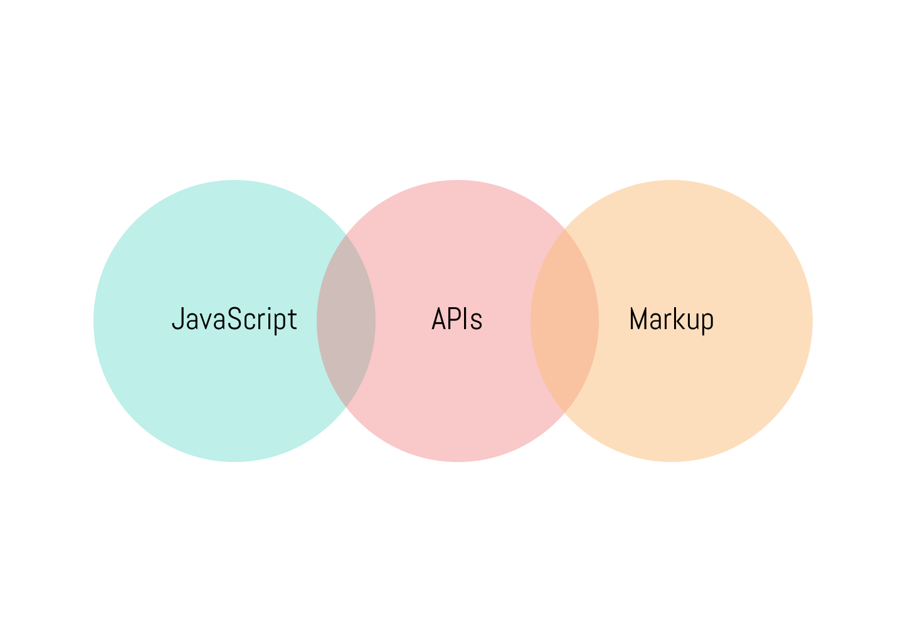

Hello!

I am Jason Schmitt and this is my first 'post'. Postings will include something along the lines of any interesting ideas or short reads. Whether its from a tech side in the web development space or an afternoon outing, I guess it could be fun to write.

Also I'm mainly trying this out as this is a personal experiment with the JAM stack!

So below I will describe what the JAMstack is, and otherwise if you're not interested in how this site is built, thanks for the visit and enjoy the reads!

# JAM stack

#### JavaScript

Any dynamic programming during the request/response cycle is handled by JavaScript, running entirely on the client. This could be any frontend framework, library, or even vanilla JavaScript.

#### APIs

All server-side processes or database actions are abstracted into reusable APIs, accessed over HTTPS with JavaScript. These can be custom-built or leverage third-party services.

#### Markup

Templated markup should be prebuilt at deploy time, usually using a site generator for content sites, or a build tool for web apps.

Built on gatsbyjs rendering this as a static site made up of react components.

Enjoy :)

-Jason
